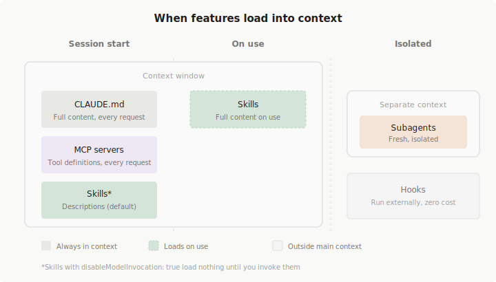

# Claude Code 확장하기
> https://code.claude.com/docs/ko/features-overview

Claude Code는 코드를 추론하는 모델과 파일 작업, 검색, 실행 및 웹 접근을 위한 내장 도구를 결합한다. 내장 도구는 대부분의 코딩 작업을 다룬다. 이 가이드는 확장 계층을 다룬다. Claude가 알아야 할 내용을 사용자 정의하고, 외부 서비스에 연결하고, 워크플로우를 자동화하기 위해 추가하는 기능이다.

---

## 1. 개요

확장은 에이전트 루프의 다양한 부분에 연결된다.

- **[CLAUDE.md](https://code.claude.com/docs/ko/memory)** 는 Claude가 모든 세션에서 보는 지속적인 컨텍스트를 추가한다.
- **[Skills](https://code.claude.com/docs/ko/skills)** 는 재사용 가능한 지식과 호출 가능한 워크플로우를 추가한다.
- **[MCP](https://code.claude.com/docs/ko/mcp)** 는 Claude를 외부 서비스 및 도구에 연결한다.
- **[Subagents](https://code.claude.com/docs/ko/sub-agents)** 는 격리된 컨텍스트에서 자신의 루프를 실행하고 요약을 반환한다.
- **[Agent teams](https://code.claude.com/docs/ko/agent-teams)** 는 공유 작업 및 피어 투 피어 메시징으로 여러 독립적인 세션을 조정한다.
- **[Hooks](https://code.claude.com/docs/ko/hooks)** 는 결정론적 스크립트로 루프 외부에서 완전히 실행된다.
- **[Plugins](https://code.claude.com/docs/ko/plugins)** 및 **[marketplaces](https://code.claude.com/docs/ko/plugin-marketplaces)** 는 이러한 기능을 패키징하고 배포한다.

Skills는 가장 유연한 확장이다. Skill은 지식, 워크플로우 또는 지침을 포함하는 마크다운 파일이며, `/deploy`와 같은 명령으로 skill을 호출하거나 Claude가 관련이 있을 때 자동으로 로드할 수 있다. Skill은 현재 대화에서 실행되거나 subagents를 통해 격리된 컨텍스트에서 실행될 수 있다.

### 기능을 목표에 맞추기

기능은 Claude가 모든 세션에서 보는 항상 켜진 컨텍스트부터 사용자나 Claude가 호출할 수 있는 온디맨드 기능, 특정 이벤트에서 실행되는 백그라운드 자동화까지 다양하다. 아래 표는 사용 가능한 기능과 각 기능이 언제 적절한지 보여준다.

| 기능 | 수행 작업 | 사용 시기 | 예시 |
|------|----------|----------|------|
| **CLAUDE.md** | 모든 대화에서 로드되는 지속적인 컨텍스트 | 프로젝트 규칙, "항상 X를 수행" 규칙 | "npm이 아닌 pnpm 사용, 커밋 전 테스트 실행" |
| **Skill** | Claude가 사용할 수 있는 지침, 지식 및 워크플로우 | 재사용 가능한 콘텐츠, 참조 문서, 반복 가능한 작업 | `/deploy`로 배포 체크리스트 실행, API 문서 skill |
| **Subagent** | 요약된 결과를 반환하는 격리된 실행 컨텍스트 | 컨텍스트 격리, 병렬 작업, 특화된 워커 | 많은 파일을 읽지만 주요 결과만 반환하는 연구 작업 |
| **Agent teams** | 여러 독립적인 Claude Code 세션 조정 | 병렬 연구, 새로운 기능 개발, 경쟁하는 가설로 디버깅 | 보안/성능/테스트를 동시에 확인하는 검토자 생성 |
| **MCP** | 외부 서비스에 연결 | 외부 데이터 또는 작업 | DB 쿼리, Slack 게시, 브라우저 제어 |
| **Hook** | 이벤트에서 실행되는 결정론적 스크립트 | 예측 가능한 자동화 (LLM 없음) | 모든 파일 편집 후 ESLint 실행 |

**Plugins**는 패키징 계층이다. 플러그인은 skill, hook, subagent 및 MCP 서버를 단일 설치 가능한 단위로 번들한다. 플러그인 skill은 네임스페이스된다(예: `/my-plugin:review`). 따라서 여러 플러그인이 공존할 수 있다. 여러 저장소에서 동일한 설정을 재사용하거나 **marketplace**를 통해 다른 사용자에게 배포하려는 경우 플러그인을 사용한다.

---

## 2. 유사한 기능 비교

### Skill vs Subagent

Skill과 subagent는 다른 문제를 해결한다. Skill은 모든 컨텍스트에 로드할 수 있는 재사용 가능한 콘텐츠이고, subagent는 주 대화와 별도로 실행되는 격리된 워커다.

| 측면 | Skill | Subagent |
|------|-------|----------|
| **정의** | 재사용 가능한 지침, 지식 또는 워크플로우 | 자신의 컨텍스트를 가진 격리된 워커 |
| **주요 이점** | 컨텍스트 간 콘텐츠 공유 | 컨텍스트 격리. 작업은 별도로 발생하고 요약만 반환 |
| **최적 용도** | 참조 자료, 호출 가능한 워크플로우 | 많은 파일을 읽는 작업, 병렬 작업, 특화된 워커 |

- **Skill은 참조 또는 작업일 수 있다.** 참조 skill은 Claude가 세션 전체에서 사용하는 지식을 제공한다(API 스타일 가이드처럼). 작업 skill은 Claude에게 특정 작업을 수행하도록 지시한다(배포 워크플로우를 실행하는 `/deploy`처럼).
- **컨텍스트 격리가 필요하거나 컨텍스트 윈도우가 가득 찰 때 subagent를 사용한다.** Subagent는 수십 개의 파일을 읽거나 광범위한 검색을 실행할 수 있지만, 주 대화는 요약만 받는다. 중간 작업이 표시될 필요가 없을 때도 유용하다. 사용자 정의 subagent는 자신의 지침을 가질 수 있고 skill을 미리 로드할 수 있다.
- **결합 가능**: subagent는 특정 skill을 미리 로드할 수 있고(`skills:` 필드), skill은 `context: fork`로 격리된 컨텍스트에서 실행 가능하다.

### CLAUDE.md vs Skill vs Rules

| 측면 | CLAUDE.md | `.claude/rules/` | Skill |
|------|-----------|-------------------|-------|
| **로드** | 모든 세션, 자동 | 모든 세션, 또는 일치하는 파일 열릴 때 | 온디맨드, 호출되거나 관련이 있을 때 |
| **범위** | 전체 프로젝트 | 파일 경로로 범위 지정 가능 | 작업별 |
| **파일 포함** | `@path` 가져오기 지원 | 미지원 | `@path` 가져오기 지원 |
| **워크플로우 트리거** | 불가 | 불가 | `/<name>`으로 직접 호출 가능 |
| **최적 용도** | 핵심 규칙, 빌드 명령 | 언어별/디렉토리별 가이드라인 | 참조 자료, 반복 가능한 워크플로우 |

- **CLAUDE.md**: 모든 세션에서 필요한 지침 (빌드 명령, 테스트 규칙, 프로젝트 아키텍처). 약 500줄 이하로 유지한다.
- **Rules**: CLAUDE.md를 집중시키기 위해 사용. `paths` frontmatter로 특정 파일 작업 시에만 로드되어 컨텍스트를 절약한다.
- **Skill**: 때때로만 필요한 콘텐츠 (API 문서, 배포 체크리스트).

### Subagent vs Agent Team

| 측면 | Subagent | Agent Team |
|------|----------|------------|
| **컨텍스트** | 자체 윈도우, 결과를 호출자에게 반환 | 완전히 독립적 |
| **통신** | 주 에이전트에게만 보고 | 팀원끼리 직접 메시징 |
| **조정** | 주 에이전트가 관리 | 공유 작업 목록, 자체 조정 |
| **토큰 비용** | 낮음 (요약만 반환) | 높음 (각 팀원이 별도 인스턴스) |

- **Subagent**: 빠르고 집중된 워커가 필요할 때
- **Agent team**: 팀원이 결과를 공유하고 독립적으로 조정해야 할 때 (실험적, 기본 비활성화)

### MCP vs Skill

| 측면 | MCP | Skill |
|------|-----|-------|
| **제공** | 도구 및 데이터 접근 | 지식, 워크플로우, 참조 자료 |
| **예시** | DB 쿼리, Slack 게시, 브라우저 제어 | 코드 검토 체크리스트, 배포 워크플로우 |

함께 사용한다: MCP가 DB에 연결하고, Skill이 스키마와 쿼리 패턴을 가르친다.

---

## 3. 기능 계층화 (우선순위)

여러 수준에 동일한 기능이 존재할 때의 처리 방식:

- **CLAUDE.md**: 추가적. 모든 수준이 동시에 로드된다. 더 구체적인 지침이 우선한다.
- **Skill**: 이름으로 재정의. 관리 > 사용자 > 프로젝트 순.
- **Subagent**: 이름으로 재정의. 관리 > CLI 플래그 > 프로젝트 > 사용자 > 플러그인 순.
- **MCP 서버**: 이름으로 재정의. 로컬 > 프로젝트 > 사용자 순.
- **Hooks**: 병합. 모든 등록된 hook이 일치하는 이벤트에 실행된다.

---

## 4. 기능 조합 패턴

| 패턴 | 작동 방식 | 예시 |
|------|----------|------|
| **Skill + MCP** | MCP가 연결, Skill이 사용법을 가르침 | MCP로 DB 연결, Skill로 스키마/쿼리 패턴 문서화 |
| **Skill + Subagent** | Skill이 병렬 작업을 subagent로 생성 | `/audit` skill이 보안/성능/스타일 subagent를 시작 |
| **CLAUDE.md + Skill** | CLAUDE.md는 항상 켜진 규칙, Skill은 온디맨드 참조 | CLAUDE.md: "API 규칙 따르기", Skill: 전체 API 가이드 |
| **Hook + MCP** | Hook이 MCP를 통해 외부 작업 트리거 | 중요 파일 수정 시 Slack 알림 |

---

## 5. 컨텍스트 비용

| 기능 | 로드 시기 | 컨텍스트 비용 |
|------|----------|-------------|
| **CLAUDE.md** | 세션 시작 | 모든 요청마다 전체 콘텐츠 |
| **Skill** | 시작 시 설명, 사용 시 전체 콘텐츠 | 낮음 (설명만). `disable-model-invocation: true`로 0 가능 |
| **MCP 서버** | 세션 시작 | 모든 요청마다 도구 정의. 10% 초과 시 Tool Search 자동 활성화 (필요한 도구만 지연 로드) |
| **Subagent** | 생성 시 | 주 세션에서 격리됨 (부풀림 방지) |
| **Hooks** | 트리거 시 | 0 (외부 실행, 출력 반환 안 하면) |

### 기능이 어떻게 로드되는지 이해하기

각 기능은 세션의 다양한 지점에서 로드된다. 아래 다이어그램은 각 기능이 언제 로드되고 무엇이 컨텍스트에 들어가는지 보여준다.

- **CLAUDE.md**: 세션 시작 시 모든 CLAUDE.md 파일의 전체 콘텐츠가 로드된다(관리, 사용자, 프로젝트 수준). 작업 디렉토리에서 루트까지의 파일은 시작 시, 하위 디렉토리 파일은 해당 파일에 접근할 때 로드된다.
- **Skill**: 기본적으로 세션 시작 시 설명만 로드되고, `/<name>` 호출 또는 Claude가 자동 로드할 때 전체 콘텐츠가 로드된다. `disable-model-invocation: true` skill은 호출 전까지 아무것도 로드되지 않는다. Subagent에서는 다르게 작동한다: `skills:` 필드로 전달된 skill은 시작 시 전체가 미리 로드된다.
- **MCP 서버**: 세션 시작 시 연결된 서버의 모든 도구 정의 및 JSON 스키마가 로드된다. Tool Search(기본 활성화)는 MCP 도구를 컨텍스트의 최대 10%까지 로드하고 나머지는 필요할 때까지 연기한다. 세션 중간에 MCP 연결이 조용히 끊길 수 있으므로 문제 시 `/mcp`로 확인한다.
- **Subagent**: 온디맨드로 생성되며, 시스템 프롬프트 + 지정된 skill + CLAUDE.md + git 상태가 포함된 격리된 컨텍스트를 받는다. 부모 대화의 대화 기록이나 호출된 skill은 상속하지 않는다.
- **Hooks**: 트리거 시 외부 스크립트로 실행된다. 기본적으로 아무것도 컨텍스트에 로드되지 않으며, hook이 출력을 반환하는 경우에만 대화에 추가된다.

### 컨텍스트 절약 팁

- CLAUDE.md를 약 500줄 이하로 유지. 참조 자료는 Skill로 이동한다.
- 부작용 있는 Skill에 `disable-model-invocation: true` 설정으로 수동 호출 전까지 컨텍스트 0.
- MCP 서버별 토큰 비용은 `/mcp`로 확인. 사용하지 않는 서버는 연결 해제한다.
- 전체 대화 컨텍스트가 필요 없는 작업은 Subagent를 사용한다.
